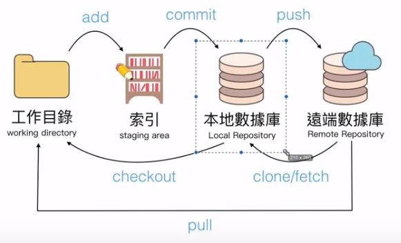
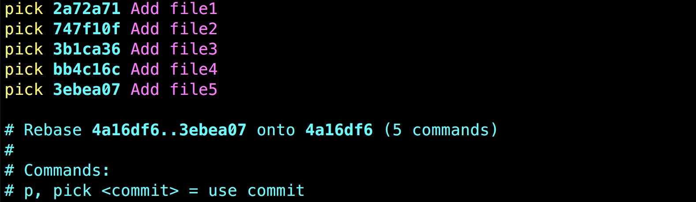
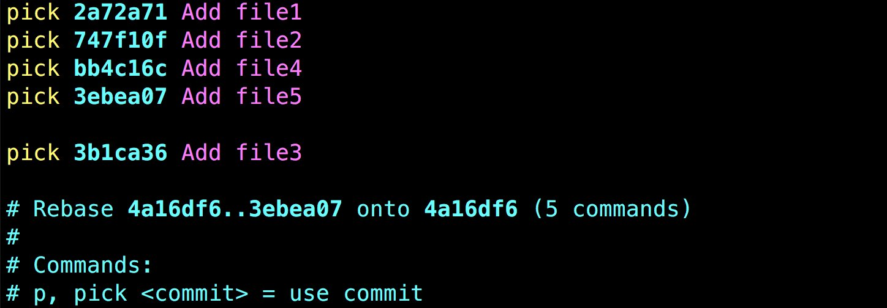
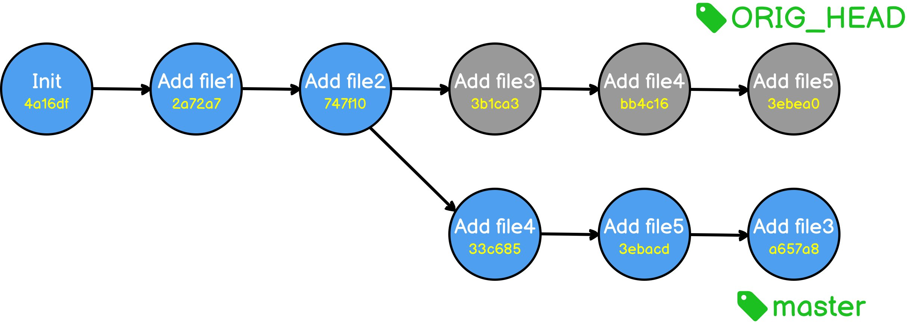
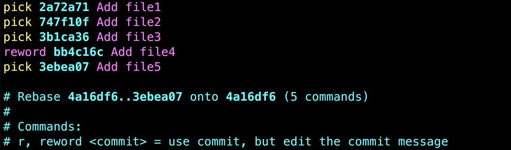
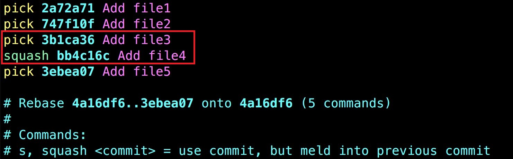
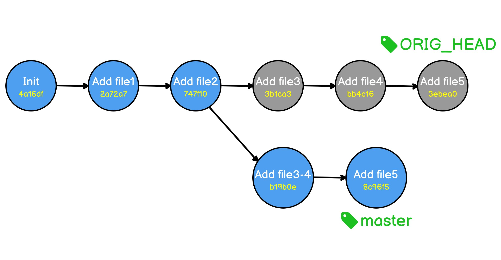

# Overview



# Basic

```
git config --list
git status -s
git log --oneline
git reflog  查看git操作歷史紀錄(使用情境：當不小心使用hard模式reset了某個commit)
git init
git add .
git commit -m "commit msg"
```

---

```
git remote	顯示遠端數據庫清單
git remote add <repository_name> <url>	註冊遠端數據庫
git remote rename <old_name> <new_name>	重新命名遠端數據庫名稱
git push <repository_name> <branch_name>
git pull <repository_name> <branch_name>
```

---

```
git branch -a	顯示分支列表
git branch <branch_name>	建立分支
git branch -d <branch_name> 刪除分支
git merge <branch_name>	合併分支
git merge <branch_name> --no--ff	合併分支(取消快轉)
git checkout <commit_number>/<branch_name>  切換版本/分支
```

---

# Advanced

## **1. Change commit order**

```
git rebase -i <commitID>
```



---



---



## **2. Change commit message**



## **3. Merge commit**



---



---

# Q&A

在新的環境(機器)初始化

```
git config --global core.editor "code --wait"
git config --global user.name "evan"
git config --global user.email evan@example.com
```

後悔 commit 怎麼辦?

```
git reset head^
git add .
git commit -m "commit message"
git push origin master --force
```

暫存

```
git stash
git stash list
git stash apply
```

後悔 rebase 怎麼辦?

```
git reset --hard ORIG_HEAD
```
